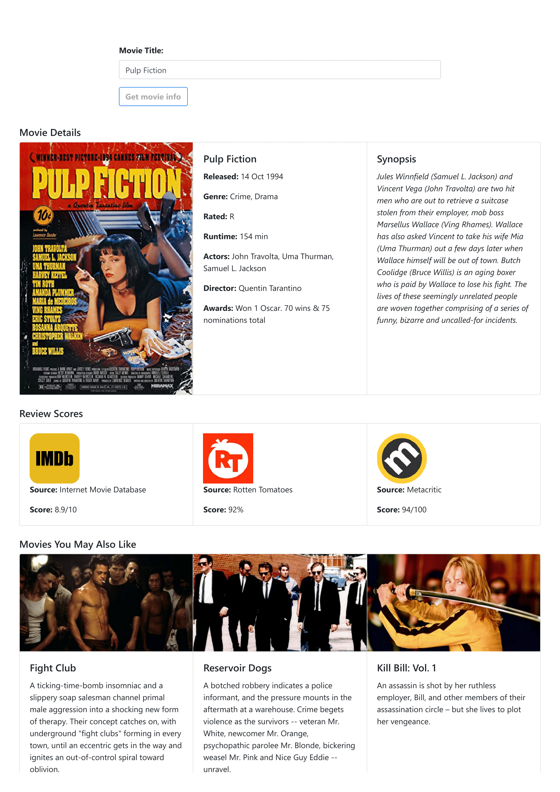

# About The Project

## Project Goal:

Based on my experience as an avid movie fan, I wanted to create a web tool that allows users to view the most pertinent information about a specific film, all in one place. 

A user can simply type in the keywords related to any movie of their choice, then click the "Click for Movie Info" button to retrieve a variety of useful information. The two standout features of this website include:

1)  **Aggregating movie scores.** This website allows you to view movie scores from three popular sources being Rotten Tomatoes, IMDb, and Metacritic. I extract the movie scores using the OMDb API, which is also used for extracting a variety of other useful information such as a movie’s year of release, synopsis, list of actors, director(s), and so forth.

2) **Generate movie recommendations.** The site also shows three recommended films based on the user's search. The list of recommendations come from the TMDB API, which allows us to generate a list of films of a similar genre that are highly rated. Similar to the movie scores, the results are shown in the format of Bootstrap cards.

## Quick Start:

The app is designed to be super easy to use. Type in any movie into the search bar, then click the button. You'll see something like the following image render below!

## Technologies Used:

This section lists all languages/frameworks/libraries/platforms used in this project:

* HTML
* CSS
* Javascript
* Bootstrap
* Moment.js
* NPM
* Browserify
* DOM
* Fetch 
* VS Code
* GitHub
* JIRA

The links to the two APIs used are as follows:

* **OMDB:** http://www.omdbapi.com
* **TMDB:** https://www.themoviedb.org
